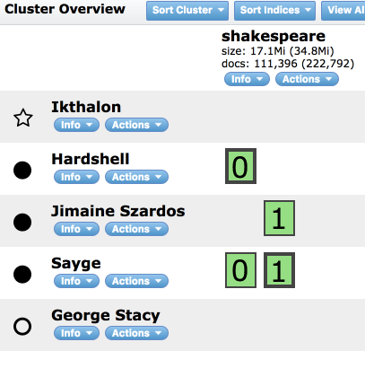
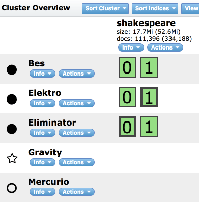

# Elastic Search 2.2 cluster

The cluster consist of the following components:

+ master node
+ master fail-over node
+ 3 data nodes
+ kibana (why not;)

Master nodes are set to have _2_ shards and _2_ replicas.

## Usage

Run the system with:

	./run.sh

After everything is up, the following pages are available:

+ [Cluster overview](http://localhost:9200/_plugin/hq/#cluster)
+ [Head overview](http://localhost:9200/_plugin/head)
+ [Kibana](http://localhost:5601)

## Dataset

After system is up, import the data:

	./insert-data.sh

This import creates `shakespeare` index. Fetch some data:

	./get-data.sh

## Clean images

The following images are created and used by the server:

	docker images | grep es2

## About shards and replicas

When you create an index (an index is automatically created when you index the first document as well) you can define how many _shards_ it will be composed of. What does it mean? It means that elasticsearch will create `N`primary shards that will contain your data.

Every time you index a document elasticsearch will decide which primary shard is supposed to hold that document and will index it there. Primary shards are not a copy of the data, they are the data! Having multiple shards does help taking advantage of parallel processing on a single machine, but the whole point is that if we start another elasticsearch instance on the same cluster, the shards will be distributed in an even way over the cluster.

Another type of shard is a _replica_. The default is 1, meaning that every primary shard will be copied to another shard that will contain the same data. Replicas are used to increase search performance and for fail-over. A replica shard is never going to be allocated on the same node where the related primary is (it would pretty much be like putting a backup on the same disk as the original data).

Shards without replicas:

Shards with replicas:

