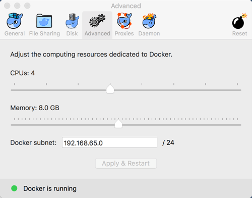

# Java Nom-Nom

## Running native

Run:

```bash
gw run
```

Before:

```
Available processors (cores): 8
Free memory: 242.9 MB
Maximum memory: 3.6 GB
Total memory: 245.5 MB
```

After:

```
Free memory: 150.1 MB
Maximum memory: 3.6 GB
Total memory: 2 GB
```

## Inside Docker

```bash
docker build -t oblac/java-nom-nom .
docker run -a stdin -a stdout oblac/java-nom-nom
```



Before:

```
Available processors (cores): 4
Maximum memory: 1.7 GB
```

After:

```
Exception in thread "main" java.lang.OutOfMemoryError: Java heap space
```

## Docker, with limits

```bash
docker build -t oblac/java-nom-nom .
docker run -a stdin -a stdout --memory=1g --cpuset-cpus=0 oblac/java-nom-nom
```

Before:

```
Available processors (cores): 1
Maximum memory: 1.9 GB
```

## Docker, limits & Java flags

```bash
docker build -t oblac/java-nom-nom .
docker run -a stdin -a stdout --memory=1g --cpuset-cpus=0 oblac/java-nom-nom
```

Before:

```
Available processors (cores): 1
Maximum memory: 247.5 MB
```
